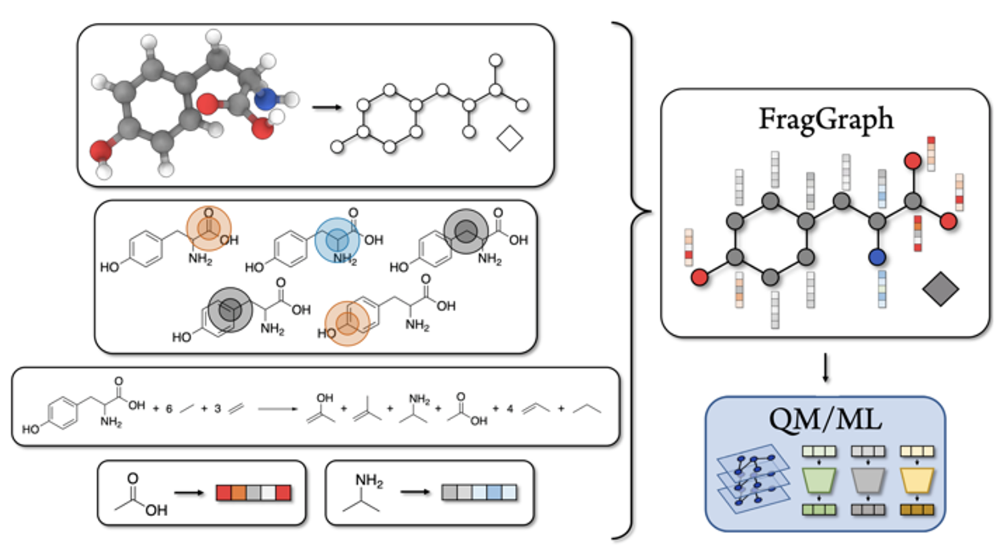
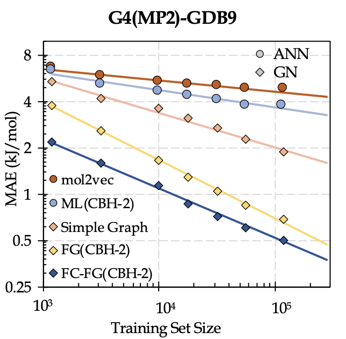

FragGraph: A Fragmentation-Based Graph Embedding Framework for QM/ML
=======

FragGraph is a framework of molecular descriptors for deep learning combining ideas from *graph theory, fragmentation, error-cancellation, and machine learning.* These representations can be derived from chemical graph theory with node and edge attributes from standard fingerprinting techniques on atom-centric fragmention from the fragmentation scheme of the [Connectivity Based Hierarchy (CBH)](https://doi.org/10.1021/ct200279q) of generalized isodemic reactions. 

This repository provides scripts to generate the FragGraph attributed graph representation.

*Authors:* 
- Eric M. Collins (Indiana University) colliner@iu.edu
- Krishnan Raghavachari (Indiana University) kraghava@iu.edu

### Performance of QM/ML models on 13k Hold-out set from GDB9-G4(MP2)

| Baseline    (QM)   | Model   (GN) | MAE  (kcal/mol)  |
|--------------|----------|----------|
| PM7       | FG(CBH-2)|     0.50|
| PM7 | FC-FG(CBH-2)|     0.38 |
| PM7      | FG(CBH-2)|    0.16 |
| B3LYP| FC-FG(CBH-2)|     0.12| 

### QM/ML Learning Curve

# Installation & Usage

## Requirements
* python (version>=3.6)
* rdkit (version>=2020.03.4)
* numpy
* networkx
* mol2vec
* xyz2mol

## Installation via conda
Clone the repository:
`git clone https://github.com/colliner/FragGraph.git`

Run `make conda_env` to create the conda environment. 

## Testing the installation
Activate the conda environment:
`conda activate FragGraph`

